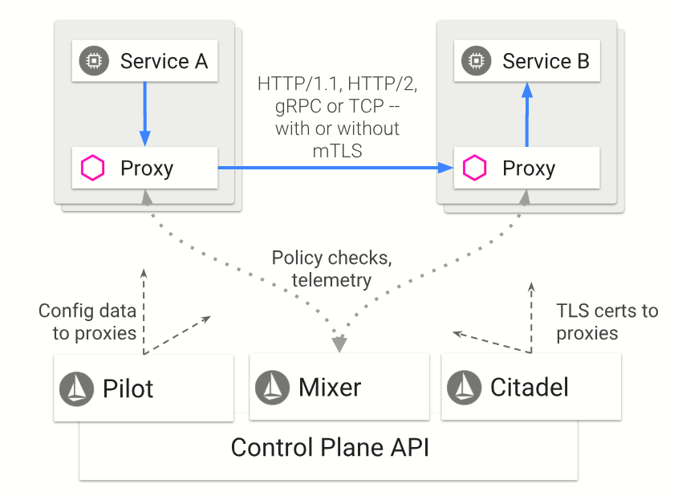

https://zhuanlan.zhihu.com/p/54123996

https://zhuanlan.zhihu.com/p/59026945

#### Istio 的核心功能
##### Istio是什么？


##### 流量管理
```
Istio 通过 Pilot 所提供的 API 动态地配置所有 Pod 中 Sidecar 的路由规则，进而控制服务间的流量和 API 调用。
Istio 简化了断路器、超时和重试等服务级别属性的配置，并且可以轻松设置 A/B 测试、金丝雀部署和基于百分比的流量分割的分阶段部署等重要任务。
```
##### 安全
```
Istio 提供给开发人员应用程序级别的安全性。Istio 提供底层安全通信信道，并大规模管理服务通信的认证、授权和加密。使用 Istio ，服务通信在默认情况下是安全的，它允许跨多种协议和运行时一致地实施策略——所有这些都很少或根本不需要应用程序更改。将 Istio 与 Kubernetes 的网络策略结合使用，其优势会更大，包括在网络和应用层保护 Pod 间或服务间通信的能力。
```
 
##### 可观察性
```
Istio 的 Mixer 组件负责策略控制和遥测收集。
通过 Istio 的监控功能，可以了解服务性能如何影响上游和下游的功能；
其自定义仪表板可以提供对所有服务性能的可视化，从而了解性能如何影响其他进程。
```

##### 平台独立
```
Istio 是独立于平台的，旨在运行在各种环境中，包括跨云、内部部署、Kubernetes、Mesos 等。
您可以在 Kubernetes 上部署 Istio 或具有 Consul 的 Nomad 上部署。
```

##### 集成和定制
```
策略执行组件可以扩展和定制，以便与现有的 ACL、日志、监控、配额、审计等方案集成。
Istio 的实现原理Istio 的架构Istio 的架构在逻辑上分为“控制面”和“数据面”。
``` 

#### 数据面，控制面
```
“数据面“：由一组 Sidecar 构成。这些 Sidecar 可以调节和控制微服务及 Mixer 之间所有的网络通信。
“控制面“：负责管理和配置代理路由流量。此外，控制面通过 Mixer 来实施策略和收集各个 Sidecar 的遥测数据。
```


#### Pilot，Mixer
```
Mixer 是一个独立于平台的组件，负责在整个 Service Mesh 中执行访问控制和使用策略，并从 Envoy 代理和其他服务收集监控到的数据。
Pilot 为 Envoy 提供服务发现；为高级路由（例如，A / B 测试，金丝雀部署等）提供流量管理功能；以及异常控制，如：超时，重试，断路器等。
```


#### 四个重要概念


##### Gateway
```
定义了 Istio 边缘的负载均衡器。所谓边缘，就是 Istio 的入口和出口。
这个负载均衡器用于接收传入或传出 Istio 的 HTTP / TCP 连接。在 Istio 中会有 ingressgateway 和 egressgateway，前者负责入口流量，后者负责出口流量。
```

##### VirtualService
```
Virtual  Services 的作用是：定义了针对 Istio 中的一个微服务的请求的路由规则。Virtual services 既可以将请求路由到一个应用的不同版本，也可以将请求路由到完全不同的应用。

说白了就是，一个路由怎么找到Service
```
##### DestinationRule
```
说白了就是服务找到了去哪一个POD
```

##### ServiceEntry
```bazaar
ServiceEntry 用于将 Istio 外部的服务注册到 Istio 的内部服务注册表，以便 Istio 内部的服务可以访问这些外部的服务，如 Istio 外部的 Web API。
```


我们先从用户请求端开始，用户的请求通过 Tencent 4 层 LB 转发到基于 Envoy 的 Istio Ingress，Ingress 根据配置将请求路由到 Service A 所在的 Pod
Service A所在Pod接收Ingress请求
* 访问Service A的请求会先到达Proxy再由它转发到Service A进程。
* Service A向Service B发出的请求被iptables路由到Proxy(下文会提到iptables的初始化)。
* Proxy进程发起对Service B所在Pod的请求。
* Proxy进程同步请求Mixer Policy服务，检查是否允许访问Service B，检查通过，开始请求。
* Proxy进程记录请求的指标（QPS，Latency，Status Code分布等），异步并批量上报到Mixer Telemetry服务，这里是客户端指标。
Service B所在Pod接收请求
* Service B Proxy接收请求并路由到Service B所在进程。
* Proxy进程记录请求的指标（QPS，Latency，Status Code分布等），异步并批量上报到Mixer Telemetry服务，这里是服务端指标。
* Service B进程处理完请求并返回
数据原路返回到用户端
以上的流程可以观察到，服务之间通信完全依靠 Proxy 进程完成，Proxy 进程接管同一个 Pod 中服务的出入流量，完成请求的路由。


Pilot Discovery: Istio的交通大脑
Pilot Discovery负责Istio服务发现，支持在Kubernetes里部署，它读取K8S资源配置，并生成Proxy可用的路由表。以下面的Service A服务为例，介绍Istio如何进行精细路由。


Proxy工作机制
Proxy代理应用流量，是分布式服务的基础。

自动注入
在K8S 1.9之后的版本，Istio 利用 K8S 提供的 MutatingAdmissionWebhook 在K8S创建Pod前回调 Istio 提供的 istio-sidecar-injector 动态修改Pod配置，添加以 Sidecar 形式运行的Container: Proxy, 以及用于初始化流量接管的 InitContainer: Proxy-init。
自动注入的开启有两个维度，一是 Namespace ，Namespace 需要添加 istio-injection: enabled 标签，这样实现该 Namespace 下的所有 Pod 自动注入 Proxy ；二是 deployment 可以设置 annotation 关闭自动注入。 
如果 K8S 版本不够，可以利用命令行工具修改 Deployment 的配置。
接管Pod流量
Service A所在 Pod 至少运行 Service A 应用容器以及用于代理的 Envoy 容器，创建 Pod 时 proxy-init 命令负责获取 Pod 监听的端口和具体协议，以此初始化网络，利用 iptables 将容器网络出入流量都转发到 Proxy 监听的 localhost 端口。
若 Service A 的 Pod 声明 servicePort 为8080:HTTP，最终 Proxy 将会接收8080端口的 Pod 入流量和全部的 Pod 出流量。
服务发现
Proxy 基于 Envoy，与 Pilot Discovery 连接，动态同步 Kubernetes 集群中所有的服务信息：服务与 Pod IP、端口之间的映射表，通过路由信息实现智能路由，从而使服务发现从业务代码中剥离。
链路追踪
Proxy 支持设置链路追踪收集 API 地址，异步上报链路追踪数据。
服务质量监控
Proxy 将各种原始属性打包上报给 Telemetry 服务，Telemetry 根据用户的配置生成指标数据并由 Prometheus 收集。